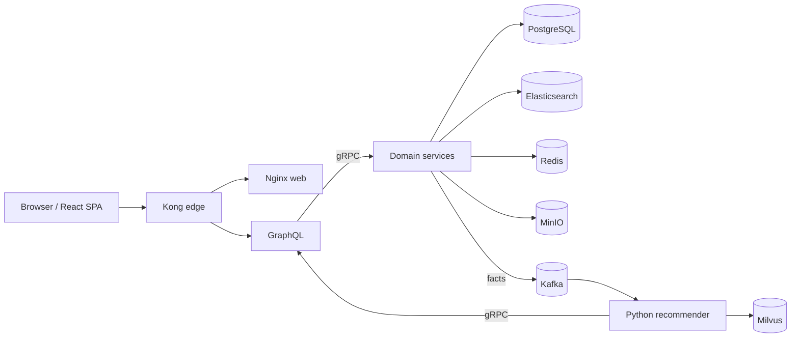

# GoshopX | GraphQL-first E-commerce Microservices

[English](#english) · [Tiếng Việt](#tieng-viet) · [Technical guide](./docs/27-technical-architecture-and-devops-guide.md) · [ADRs](./docs/adr/)

<p align="center"></p>

<p align="center">


</p>

## English

GoshopX is a GraphQL-first e-commerce platform. Go services own account, catalogue, order, payment, inventory, cart, notification and reporting capabilities. The Python recommender consumes durable facts and provides recommendation/chat. GraphQL is the only browser contract; gRPC is internal synchronous communication and Kafka carries durable business facts.

### Implemented capabilities

- Shopper: registration/login (including Google), catalogue/search, cart, stock reservation, checkout hand-off, COD, payment return, notifications, orders and recommendation chat.
- Operations: RBAC, account governance, catalogue moderation/media upload, inventory adjustment, cancellation, payment reconciliation/refund, dashboard, audit, low-stock and reservation views.
- Edge: Kong exposes the SPA, `POST /graphql`, Playground/health and the narrow payment IPN only. gRPC and data stores are private.
- Delivery: Docker Compose locally; Helm + K3s + Argo CD GitOps in the lab; GitHub Actions tests, scans, creates immutable GHCR images and promotes their SHA in Git.



### Stack

| Area | Technology | Purpose |
| --- | --- | --- |
| UI | React, TypeScript, Vite, Nginx | typed SPA, fast build, static delivery |
| APIs | GraphQL/gqlgen/Gin, gRPC/Protobuf, Kong | public capability API, internal contracts, secure edge |
| Data | PostgreSQL, Elasticsearch, Redis, MinIO | transactions, search, TTL cart/cache, product objects |
| Events/AI | Kafka, Python, LangChain/LangGraph, Milvus | business facts, recommendation and hybrid retrieval |
| Platform | Docker, Helm, K3s, Argo CD, GitHub Actions | local runtime, declarative GitOps delivery |
| Quality | Trivy, TruffleHog, Prometheus, Grafana, Loki, Jaeger, k6 | security gates, metrics, logs, traces and load checks |

### Quick start

```powershell
Copy-Item .env.example .env
docker compose config --quiet
docker compose up --build -d
```

Open `http://localhost:8080/`, `http://localhost:8080/playground`, or `http://localhost:8080/health`.

```powershell
$packages = go list ./... | Where-Object { $_ -notmatch '/tests/e2e$' }
go test -race -count=1 $packages
Push-Location recommender; uv sync --frozen; uv run pytest; Pop-Location
Push-Location web; npm ci; npm test -- --run; npm run build; Pop-Location
```

`docker compose up` proves container orchestration, not every dependency's readiness or an end-to-end customer journey. Use the [bilingual technical guide](./docs/27-technical-architecture-and-devops-guide.md) for architecture, workflows, design system, DevOps, test boundaries and rollback.

## Tiếng Việt

GoshopX là nền tảng thương mại điện tử GraphQL-first. Service Go sở hữu account, catalog, order, payment, inventory, cart, notification và reporting. Recommender Python tiêu thụ business fact bền vững và cung cấp gợi ý/chat. GraphQL là contract duy nhất cho browser; gRPC dành cho giao tiếp nội bộ đồng bộ, Kafka mang business fact bền vững.

- Khách hàng: đăng ký/đăng nhập (có Google), catalog/search, cart, giữ tồn, checkout, COD, kết quả payment, notification, order và chat gợi ý.
- Vận hành: RBAC, quản trị account, kiểm duyệt catalog/upload media, điều chỉnh tồn, hủy đơn, đối soát/hoàn tiền, dashboard, audit và low-stock.
- Phát hành: Docker Compose local; Helm + K3s + Argo CD GitOps cho lab; GitHub Actions test, scan, build image SHA bất biến rồi promote vào Git.

Tài liệu song ngữ đầy đủ về kiến trúc, luồng nghiệp vụ, techstack, design system, DevOps, build/run/test và rollback nằm tại [Technical Architecture and DevOps Guide](./docs/27-technical-architecture-and-devops-guide.md).

Không commit `.env`, JWT, mật khẩu hay key OAuth/SMTP/VNPay/AI/Kubernetes. Giá trị Compose mặc định chỉ dành cho local; browser không được gọi trực tiếp gRPC, Kafka, Redis, PostgreSQL, Elasticsearch hay MinIO.

## Documentation | Tài liệu

- [Documentation index](./docs/00-index.md)
- [Business rules](./docs/03-business-domain-rules.md)
- [Architecture guide](./docs/04-architecture-decision-guide.md)
- [Technical guide](./docs/27-technical-architecture-and-devops-guide.md)
- [ADRs](./docs/adr/)
- [K3s operator guide](./docs/23-ubuntu-k3s-step-by-step-deployment.md)

## License

See [LICENSE](./LICENSE).
