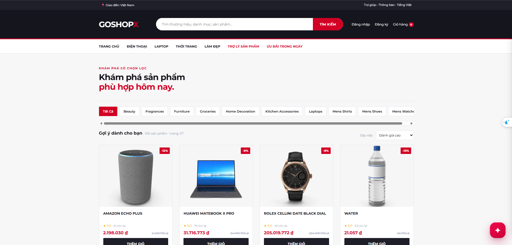

# GoshopX

### GraphQL-first e-commerce microservices with event-driven commerce, operations tooling, and AI-assisted product discovery.

[Documentation](./docs/00-index.md) | [Technical Guide](./docs/27-technical-architecture-and-devops-guide.md) | [ADRs](./docs/adr/) | [K3s Runbook](./docs/23-ubuntu-k3s-step-by-step-deployment.md)

  
  
  
  
  
  
  
  
  
  
  
  
  
  
  
  

> **Status:** actively developed laboratory platform. CI, local configuration, Helm rendering, browser E2E, external providers, and live K3s releases are distinct verification levels.

## Navigation

- [Installation](#installation) | [Quick start](#quick-start) | [Features](#features) | [Architecture](#architecture)
- [Workflow](#commerce-workflow) | [Commands](#commands) | [Configuration](#configuration) | [Integrations](#integrations)
- [Observability](#observability) | [Security](#security) | [Docker and Kubernetes](#docker-and-kubernetes)
- [Roadmap](#roadmap) | [Contributing](#contributing) | [Documentation](#documentation) | [FAQ](#faq) | [License](#license)

## Overview

GoshopX is a full-stack e-commerce reference platform for developers, students, and platform engineers who need a browser-safe API while keeping commerce domains independently owned. React calls GraphQL through Kong; Go services use typed gRPC for immediate internal decisions; Kafka distributes durable business facts; each bounded context owns its persistence. A Python recommender provides ranking and hybrid retrieval without making commerce unavailable when AI artifacts are missing.

## Features

| Capability | What it provides |
| --- | --- |
| Identity and RBAC | Registration, login, Google identity, JWT, account status, and role-aware administration. |
| Product catalogue | Elasticsearch search, categories, moderation, reviews, and product-media metadata. |
| Cart and reservation | Redis-backed active cart with Inventory-controlled stock reservation. |
| Checkout and payment | Server-authoritative orders, COD, and VNPay checkout/IPN verification. |
| Operations | Account controls, moderation, inventory adjustment, refunds, reporting, and audit projections. |
| Recommendations | Kafka-fed ranking, vector/hybrid retrieval, and guarded recommendation chat. |
| Delivery | Prometheus, Loki, Jaeger, Helm/K3s, and Argo CD GitOps lab assets. |

## Architecture

~~~mermaid
flowchart LR
  Browser[React SPA] --> Kong[Kong edge]
  Kong --> Web[Nginx web]
  Kong --> GQL[GraphQL gateway]
  GQL -->|gRPC| Services[Go domain services]
  Services --> PG[(PostgreSQL)]
  Services --> ES[(Elasticsearch)]
  Services --> Redis[(Redis)]
  GQL --> MinIO[(MinIO media)]
  Services -->|business facts| Kafka[(Kafka)]
  Kafka --> Rec[Python recommender]
  Rec --> Milvus[(Milvus)]
  Rec -->|gRPC| GQL
~~~

| Service | Owns | Storage |
| --- | --- | --- |
| Account | identity, credentials, roles, status | PostgreSQL |
| Product | catalogue, categories, moderation, search | Elasticsearch |
| Inventory and Cart | stock/reservations; active cart | PostgreSQL; Redis |
| Order and Payment | order totals; verified transaction state | PostgreSQL |
| Notification and Admin | notification feed; reporting/audit projection | PostgreSQL + Redis |
| Recommender | interaction projection, artifacts, retrieval/chat | PostgreSQL + Milvus |

**Boundary contract:** browsers call GraphQL only; gRPC is internal synchronous RPC; Kafka carries asynchronous facts; services never read another service database directly.

## Commerce workflow

1. Shopper adds a cart item through GraphQL; Cart asks Inventory to reserve stock with a TTL.
2. Checkout creates an Order from Product-owned price data, never from client totals.
3. Payment creates the provider redirect and accepts the narrowly routed provider IPN.
4. Payment verifies checksum, terminal, amount, pending state, and duplicate callbacks before emitting business facts.
5. Notification, Admin, and Recommender consume facts as eventually consistent, idempotent projections.

## Installation

### Requirements

| Tool | Use |
| --- | --- |
| Docker Desktop + Docker Compose | local integrated runtime |
| Go 1.25+ | Go services and tests |
| Python 3.11 + [uv](https://docs.astral.sh/uv/) | recommender dependencies/tests |
| Node.js + npm | React web development/tests |
| Helm, kubectl, K3s access | optional GitOps lab operation |

~~~powershell
git clone https://github.com/Tuananh165-art/GoshopX.git
Set-Location GoshopX
Copy-Item .env.example .env
~~~

Never commit `.env`, `recommender/.env`, JWTs, provider keys, SMTP passwords, or Kubernetes runtime secrets.

## Quick start

~~~powershell
docker compose config --quiet
docker compose up --build -d
docker compose ps
docker compose logs --tail 100 graphql product payment
Invoke-WebRequest http://localhost:8080/health
~~~

| Endpoint | Purpose |
| --- | --- |
| `http://localhost:8080/` | Storefront / operations SPA through Kong |
| `http://localhost:8080/graphql` | GraphQL endpoint |
| `http://localhost:8080/playground` | GraphQL Playground |
| `http://localhost:8080/health` | GraphQL health |
| `http://localhost:8088` | Kafka UI |
| `http://localhost:9001` | MinIO Console |
| `http://localhost:5601` | Kibana |
| `http://localhost:5540` | RedisInsight |

## Commands

~~~powershell
$packages = go list ./... | Where-Object { $_ -notmatch '/tests/e2e$' }
go test -race -count=1 $packages
go test ./tests/e2e

Push-Location recommender; uv sync --frozen; uv run pytest; Pop-Location
Push-Location web; npm ci; npm test -- --run; npm run build; npm run test:e2e; Pop-Location

helm lint deploy/helm/goshopx -f deploy/helm/goshopx/values-lab.yaml
helm template goshopx deploy/helm/goshopx -f deploy/helm/goshopx/values-lab.yaml
~~~

## Configuration

Start with [`.env.example`](./.env.example), which provides names and safe placeholders only.

| Group | Examples |
| --- | --- |
| Routing | `*_SERVICE_URL`, `KAFKA_BOOTSTRAP_SERVERS` |
| Data | `*_DATABASE_URL`, `REDIS_URL`, `MILVUS_URI` |
| Security | `SECRET_KEY`, `ISSUER`, `GOOGLE_CLIENT_ID` |
| Payment | `VNPAY_TMN_CODE`, `VNPAY_HASH_SECRET` |
| Media/AI | `MINIO_*`, `AI_*` |
| Messaging | `*_EVENTS_TOPIC` |

Compose credentials are development defaults, not production secrets. Create Kubernetes runtime Secrets outside Git.

## Integrations

| Integration | Boundary | Notes |
| --- | --- | --- |
| Google Sign-In | Account / GraphQL | Server-side identity validation and approved origins. |
| VNPay Sandbox | Payment IPN through Kong | Only `GET /webhook/payment` is public; checksum validation is mandatory. |
| DummyJSON | Product seed input | Repeatable demo source, never payment/stock authority. |
| MinIO | Product media | Object bytes stay in MinIO; Product stores references. |
| SMTP/Gmail | Notification | Credentials remain runtime secrets. |
| Milvus + LLM | Recommender | Optional AI path degrades gracefully. |

## Observability

Go services expose private Prometheus metrics. ServiceMonitors scrape metrics; Grafana reads Prometheus/Loki; Alloy collects logs; Jaeger receives OTLP only when tracing is configured. For a real E2E observability claim, require the same request to show service readiness, a Prometheus target **UP**, a Loki log, and a correlated Jaeger trace. See [Application Observability](./docs/25-application-observability.md).

## Security

- GraphQL is the browser boundary; do not expose internal gRPC, Kafka, or databases.
- JWTs, passwords, and keys must not appear in logs, README, screenshots, or commits.
- Payment verifies signed callback data before mutating transaction, order, inventory, or cart state.
- Kafka consumers handle malformed and duplicate data safely; refund requests use an idempotency key.
- CI configures TruffleHog verified-secret scanning and Trivy configuration scanning; the release workflow scans images for configured HIGH/CRITICAL findings.

## Docker and Kubernetes

Docker Compose provides local orchestration; `depends_on` controls start order, not readiness. The K3s lab uses Traefik -> DB-less Kong -> Web/GraphQL. Internal gRPC/data systems are private ClusterIP services. GitHub Actions builds/scans immutable GHCR images, commits the selected SHA to Helm values, and Argo CD reconciles Git into K3s. CI does not receive a cluster kubeconfig.

For Helm rollback, also revert the Git promotion commit; otherwise Argo CD reapplies the undesired revision. Follow the [Ubuntu K3s guide](./docs/23-ubuntu-k3s-step-by-step-deployment.md).

## Roadmap

- [ ] Pin Web dependencies and resolve reviewed advisory findings.
- [ ] Add readiness/retry evidence for critical Compose dependencies.
- [ ] Contract-test GraphQL, gRPC, and Kafka mappings.
- [ ] Run browser E2E in CI with a supported Playwright environment.
- [ ] Add verified Python recommender OpenTelemetry spans.
- [ ] Establish production backup/restore, HA, TLS, secret management, and DR practices.

## Contributing

1. Read [project rules](./.agents/rules/project-rules.md), business rules, and affected ADRs.
2. Keep GraphQL public, gRPC internal, Kafka event-driven, and persistence service-owned.
3. Add focused tests and update contracts/runbooks/ADRs with boundary changes.
4. Never commit secrets or local runtime state.

## Documentation

- [Documentation index](./docs/00-index.md)
- [Technical architecture and DevOps guide](./docs/27-technical-architecture-and-devops-guide.md)
- [Business domain rules](./docs/03-business-domain-rules.md)
- [Architecture decision guide](./docs/04-architecture-decision-guide.md)
- [DevSecOps quality gates](./docs/05-devsecops-quality-gates.md)
- [Runtime configuration](./docs/09-runtime-configuration.md)
- [Frontend UI/UX specification](./docs/20-frontend-ui-ux-spec.md)
- [K3s operations](./docs/26-k3s-lab-current-operations.md)

## FAQ

<strong>Why does the browser not call gRPC directly?</strong>

GraphQL is the public contract. It hides internal topology, centralizes public context, and prevents browser coupling to private endpoints.

<strong>Does Docker Compose prove the platform works end to end?</strong>

No. It proves configured container orchestration. Provider credentials, readiness, initialized data, browser capability, Kafka flow, and K3s access need their own checks.

<strong>Is K3s production HA?</strong>

No. This repository documents a resource-bounded, single-node laboratory deployment. Production needs separate availability, backup, security, and recovery work.

## License

Distributed under the [Apache License 2.0](./LICENSE).
