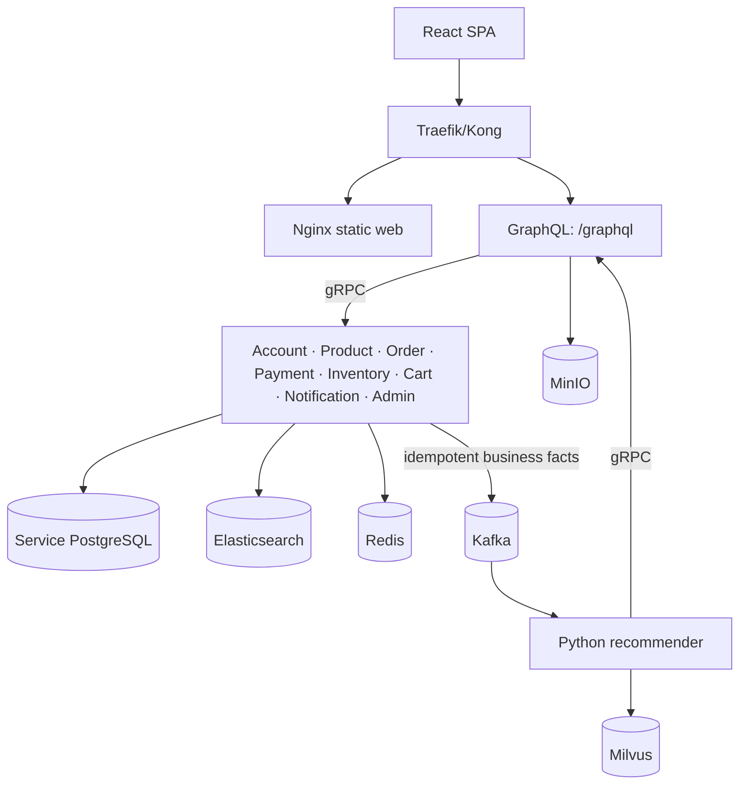
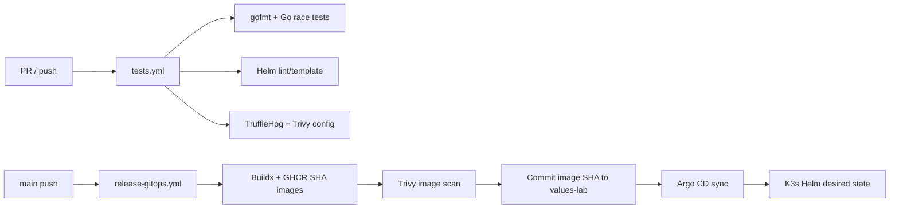

# GoshopX Technical Architecture and DevOps Guide | Tài liệu Kiến trúc Kỹ thuật và DevOps

Status: Source-reviewed documentation baseline  
Date: 2026-09-15  
Scope: source code, manifests, CI workflows and existing runbooks. This document describes implementation; it does **not** claim that a live stack was run as part of this documentation change.

## 1. Problem and architectural answer | Vấn đề và lời giải kiến trúc

**EN.** An e-commerce client needs a stable public API, while identity, search, stock, payment, media and AI have different ownership, consistency and failure characteristics. GoshopX applies a GraphQL public boundary, service-owned data, gRPC for immediate internal answers and Kafka for durable asynchronous business facts. This prevents browser-to-database coupling and prevents a shared database from becoming the hidden integration layer.

**VI.** Client thương mại điện tử cần API công khai ổn định, trong khi danh tính, search, tồn kho, payment, media và AI có ownership, nhất quán và failure mode khác nhau. GoshopX áp dụng GraphQL làm public boundary, dữ liệu do service sở hữu, gRPC cho câu trả lời nội bộ tức thời và Kafka cho business fact bất đồng bộ bền vững. Cách này tránh browser phụ thuộc database và tránh shared database trở thành lớp tích hợp ngầm.

## 2. Source map, ownership and tech stack | Bản đồ source, ownership và techstack

| Component | Owns / sở hữu | Storage | Contract / công dụng |
| --- | --- | --- | --- |
| `web` | shopper/admin presentation, client route state | browser state only | React/TypeScript/Vite UI calls same-origin GraphQL |
| `graphql` | public schema, JWT context, resolver composition | no business DB | gqlgen/Gin; calls service gRPC; media handoff to MinIO |
| `account` | identity, password hash, Google identity, role/status, JWT | PostgreSQL | authentication and policy owner |
| `product` | product/category/moderation/search metadata | Elasticsearch | searchable catalogue; `product_events`; MinIO references |
| `inventory` | stock, reservations, availability/reorder | PostgreSQL | atomic reserve/release/adjust; `inventory_events` |
| `cart` | active cart + reservation coordination | Redis TTL JSON | short-lived state; calls Inventory; `cart_events` |
| `order` | order and server-calculated total | PostgreSQL | Account/Product gRPC; `order_events` |
| `payment` | transaction state and verified provider callback | PostgreSQL | checkout/IPN; `payment_events` |
| `notification` | in-app notification and optional email | PostgreSQL | event consumer |
| `admin` | reporting/audit projection | PostgreSQL + Redis | event-fed CQRS read model, never domain writer |
| `recommender` | interaction projection, model artifacts, retrieval/chat | PostgreSQL + artifacts + Milvus | Python Kafka consumer and gRPC server |

Technology purpose / ý nghĩa công nghệ:

| Layer | Tech | Why / giải quyết gì |
| --- | --- | --- |
| Service | Go, GORM, gRPC, Protobuf | efficient small services, typed persistence and internal contracts |
| Public edge | GraphQL, gqlgen, Gin, Kong | one typed browser API; routing, rate-limit and correlation ID |
| Data | PostgreSQL, Elasticsearch, Redis, MinIO | transaction truth, product search, TTL cart/cache, media objects |
| Event/AI | Kafka, Python 3.11, implicit, LangChain/LangGraph, Milvus | replayable facts, ranking, RAG/hybrid retrieval |
| Platform | Docker Compose, Helm, K3s, Argo CD, GHCR | local parity, declarative deployment and GitOps reconciliation |
| Quality | GitHub Actions, Trivy, TruffleHog, Prometheus, Grafana, Loki, Jaeger, OpenTelemetry, k6 | tests/scans and measurable runtime evidence |

**Ownership rule | Quy tắc ownership:** the owning service validates and writes its state. Another service receives a gRPC response or Kafka event; it never reads the owner's database directly.

## 3. Topology and contracts | Topology và contract



| Boundary | Rule | Reason |
| --- | --- | --- |
| Browser → backend | GraphQL only | topology and credentials stay private; schema is the public contract |
| Service → service | gRPC/Protobuf for synchronous decisions | identity, price, availability and commands need an immediate result |
| Cross-domain propagation | Kafka | durable, replayable, eventually consistent business facts |
| Provider → payment | only `GET /webhook/payment` | IPN cannot issue GraphQL; Payment verifies signature before write |
| Data | owned by one bounded context | avoids cross-service SQL coupling and unclear authority |

GraphQL schema changes require resolver/generated-model/client alignment. Protobuf changes need Go/Python generation and backward-compatibility review. Event payloads need a version/deduplication key because consumers can replay or receive duplicates.

## 4. Feature workflows | Luồng tính năng

### Authentication and RBAC | Xác thực và RBAC

1. Web calls `register`, `login` or `loginWithGoogle` at GraphQL.
2. GraphQL delegates to Account gRPC; Account hashes/verifies credentials or Google identity, reads role/status and returns JWT.
3. GraphQL JWT middleware places identity/role in context. Privileged operations recheck policy in the owner service.

**EN:** hiding an admin button is a UX improvement, never authorization. **VI:** ẩn nút admin chỉ là UX, không thay thế authorization ở server.

### Cart, stock and checkout | Giỏ hàng, tồn kho và checkout

```mermaid
sequenceDiagram
  participant U as Shopper
  participant G as GraphQL
  participant C as Cart/Redis
  participant I as Inventory/Postgres
  participant O as Order/Postgres
  participant P as Payment
  participant K as Kafka
  U->>G: addCartItem(product, quantity)
  G->>C: gRPC add/update
  C->>I: reserve stock with TTL
  I-->>C: reservation + availability
  U->>G: checkoutCart(redirect URL)
  G->>O: create order; Product data calculates total
  G->>P: create checkout with order/reservations
  P-->>U: provider redirect URL
  P->>K: verified payment fact after IPN
```

- Positive price and the Product service determine the order total; client price is never authoritative.
- Reservation is temporary; UI can call it reserved only after GraphQL confirms it.
- Browser return is not settlement. Payment verifies HMAC-SHA512, terminal, amount, pending state and success codes; duplicate IPNs must not repeat side effects.

### Catalogue, media, recommendations and admin | Catalog, media, gợi ý và admin

Product owns Elasticsearch documents. DummyJSON is a repeatable demo seed, not the source of truth for payment or stock. Media bytes belong in MinIO; Product stores metadata/object references. Published products require approved moderation. Kafka product/interaction facts feed recommender projections, rankers and Milvus hybrid retrieval. The recommender degrades gracefully if history/model is missing.

Account owns roles/status. Admin consumes domain facts into a CQRS reporting/audit read model. Commands still go to Product, Order, Payment or Inventory owners, so dashboard data can be eventually consistent without breaking write authority.

## 5. Design system and frontend method | Design system và phương pháp frontend

**EN.** The React source is feature-first: `app` composes routes/providers; `components` is reusable layout/UI; `features` owns catalog, auth, cart, checkout, admin and recommendation behavior; `shared/api` isolates adapters. Routes are lazy-loaded. `AuthContext` and `CartContext` hold cross-page state. Pages must show loading, empty, retry and forbidden states, never invent business data.

**VI.** Source React theo feature-first: `app` ghép routes/providers; `components` chứa layout/UI tái sử dụng; `features` sở hữu catalog, auth, cart, checkout, admin, recommendation; `shared/api` cô lập adapter. Routes lazy-load. `AuthContext`/`CartContext` giữ state xuyên trang. Page phải thể hiện loading, empty, retry, forbidden; không bịa business data.

- Mobile-first: catalogue targets 4/3/2 columns on desktop/tablet/phone; filters scroll horizontally and cart summary stacks on small screens.
- Accessibility: controls target at least 42px; preserve keyboard focus, semantic labels and recoverable errors.
- Trust boundary: same-origin `/graphql`; Vite proxies in development. Browser never calls gRPC/Kafka/databases/object storage.
- UI total is estimated until backend validates stock, reservation and price. Admin UI is deny-by-default but server policy is authoritative.

## 6. DevOps and DevSecOps workflow | Quy trình DevOps và DevSecOps

### Local loop | Chu trình local

1. Copy `.env.example` to `.env`; keep real secret values local only. Compose defaults are local defaults, never production secrets.
2. Run `docker compose config --quiet` to validate resolved configuration.
3. Run the narrowest unit/contract tests first, then broader suites for shared contracts.
4. `docker compose up --build -d` only for the necessary slice or full stack.
5. Inspect `docker compose ps`, targeted logs and actual endpoints. `depends_on` controls start order, **not** readiness.
6. State precisely what passed and which provider/browser/cluster condition was unavailable.

### CI → GitOps | CI → GitOps



`tests.yml` runs Go formatting/race tests, Helm render/lint, TruffleHog verified-secret scanning and Trivy configuration scanning. `release-gitops.yml` builds/scans each service image, then commits the immutable SHA tag to `values-lab.yaml`. Argo CD has cluster authority; CI has repo/registry authority. Git is therefore desired state, and CI does not need a cluster kubeconfig.

### K3s lab security and observability | Bảo mật và quan sát lab

- Traefik forwards public traffic to DB-less Kong. Kong exposes Web, GraphQL and the narrow payment IPN; internal gRPC is ClusterIP and Kong Admin is private.
- Helm values use runtime Secret references for sensitive values and ConfigMap-like non-secret endpoints/flags. Secret input is created outside Git and must be owner-controlled.
- Prometheus scrapes private `/metrics`; Alloy sends Kubernetes logs to Loki. Go services enable OTLP tracing only when configured. A Jaeger installation alone does not prove trace emission.
- This is a single-node, resource-bounded K3s lab, not HA production. Production needs backup/restore tests, HA data services, mature secret management, TLS/DR/capacity planning.

## 7. Build, run, test and validation boundaries | Build, chạy, test và ranh giới xác minh

```powershell
Copy-Item .env.example .env
docker compose config --quiet
docker compose up --build -d
docker compose ps
docker compose logs --tail 100 graphql product payment
Invoke-WebRequest http://localhost:8080/health

$packages = go list ./... | Where-Object { $_ -notmatch '/tests/e2e$' }
go test -race -count=1 $packages
go test ./tests/e2e

Push-Location recommender
uv sync --frozen
uv run pytest
Pop-Location

Push-Location web
npm ci
npm test -- --run
npm run build
npm run test:e2e
Pop-Location
```

| Evidence level | It proves | It does not prove |
| --- | --- | --- |
| Compose config / Helm render | syntax and resolved declarative configuration | running readiness, credentials or customer flow |
| build/type/unit tests | buildable code and tested isolated behavior | Kafka/provider/browser/K3s integration |
| endpoint/container check | process and narrow route are live | complete cross-service journey |
| E2E/contract test | configured workflow behavior | production resilience/security under all load |
| live observability | only when pod ready + Prometheus target UP + matching Loki log + Jaeger trace | a dashboard or single healthy pod alone |

For a Helm/K3s incident, emergency Helm rollback may restore a revision, but the Git promotion must also be reverted because Argo reconciles Git. Do not manually edit payment rows as rollback; restore a validated configuration/adapter and retain idempotency.

## 8. Plan, TODO and Definition of Done | Kế hoạch, TODO và DoD

| Priority | Todo | Issue solved | Acceptance evidence |
| --- | --- | --- | --- |
| P0 | Pin web dependencies; review/remediate audit findings | `latest` dependencies harm repeatability | lockfile + build/test evidence + reviewed advisories |
| P0 | Add Compose readiness/retry evidence for critical dependencies | startup order is not readiness | controlled restart and endpoint proof |
| P0 | Contract-test GraphQL ↔ gRPC ↔ events | generated code can compile while mappings drift | identity, role, price and idempotency tests |
| P0 | Production secret/rotation runbook | local defaults are not secure production config | least privilege and rotation drill |
| P1 | Run supported Playwright E2E in CI | UI build is not browser evidence | mobile/desktop/auth/forbidden/retry/checkout handoff |
| P1 | Explicit outbox/replay design per data owner | publish-after-write failures create gaps | event schema, dedupe key, replay/backfill exercise |
| P1 | Instrument recommender with OTEL | Go traces do not prove AI path tracing | correlated GraphQL-to-recommender trace |
| P2 | Production-readiness programme | single VPS lab is not HA | restore, DR, TLS, capacity and incident exercises |

**Definition of Ready / Sẵn sàng:** actor, invariant, owner, GraphQL/gRPC/event impact, migration, security abuse case, observability signal and focused test are known.

**Definition of Done / Hoàn thành:** formatted code, focused tests, synchronized contracts/docs, no secrets, security review for auth/payment/PII/input, documented deployment/rollback impact, and evidence reported without claiming unavailable runtime checks.

## 9. Related ADRs and documents | ADR và tài liệu liên quan

Existing ADRs record core-commerce boundaries, admin RBAC/read model, Kong edge gateway, DummyJSON catalogue and K3s GitOps lab. This documentation baseline is governed by [ADR-20260915](./adr/ADR-20260915-documentation-as-code-and-evidence-boundaries.md). Update it whenever an ownership boundary, API/protobuf/event, data store, provider, deployment topology or verification method changes.

- [Business rules](./03-business-domain-rules.md)
- [Architecture decision guide](./04-architecture-decision-guide.md)
- [DevSecOps quality gates](./05-devsecops-quality-gates.md)
- [Frontend UI/UX specification](./20-frontend-ui-ux-spec.md)
- [VNPay sandbox payment](./19-vnpay-sandbox-payment.md)
- [K3s deployment guide](./23-ubuntu-k3s-step-by-step-deployment.md)
- [Application observability](./25-application-observability.md)
